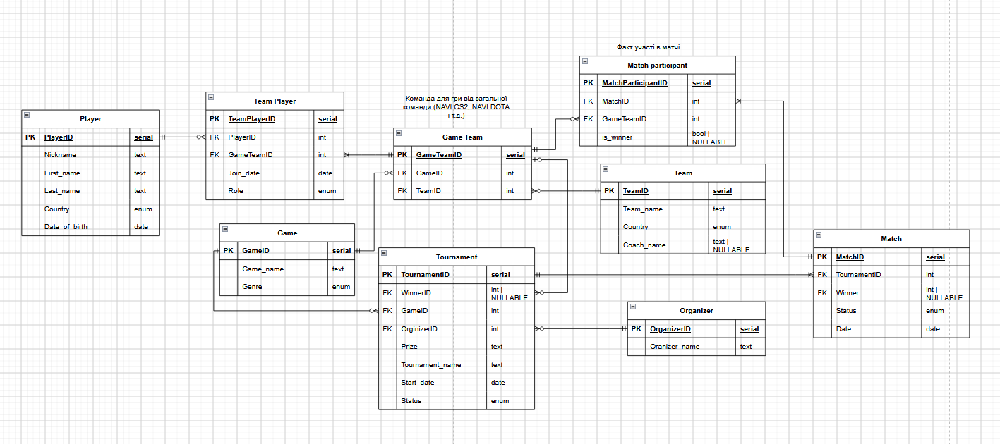

# Лабораторна робота №1

## Збір вимог та розробка схеми ER

**Лабораторну роботу виконували студенти групи ІМ-51:**

- Драшпуль Олександр
- Вітер Захар
- Колодій Олександр

---

# Результати

## Вимоги

- Система повинна зберігати інформацію про гравців, зокрема їхній нікнейм, ім'я, прізвище, країну та дату народження.
- Система повинна зберігати інформацію про команди, включаючи назву команди, країну та тренера.
- Система повинна дозволяти менеджити склад команд
- Система повинна дозволяти створювати кіберспортивні турніри та керувати ними.
- Система повинна зберігати інформацію про матчі та турніри, включаючи дату проведення та результати
- Система повинна дозволяти переглядати інформацію про команди, гравців, турніри та результати матчів.

---

# Сутності

## Player

Таблиця з інформацією про гравця

| Атрибут | Опис |
|---|---|
| **PlayerID** | Ідентифікатор гравця (PK) |
| **Nickname** | Ігровий псевдонім |
| **First_name** | Ім’я гравця |
| **Last_name** | Прізвище гравця |
| **Country** | Країна яку гравець представляє |
| **Date_of_birth** | Дата народження |

### Player - Team Player (1:N/0)

Один гравець може бути учасником багатьох команд або жодної команди

---

## Team Player

Таблиця яка зберігає інформацію про гравця як учсника команди

| Атрибут | Опис |
|---|---|
| **TeamPlayerID** | Ідентифікатор учасника команди (PK) |
| **PlayerID** | Ідентифікатор гравця, позичений з таблиці Players (FK) |
| **GameTeamID** | Ідентифікатор команди по грі, позичений з таблиці Game Team (FK) |
| **Join_date** | Дата приєднання до команди |
| **Leave_date** | Дата виходу з команди (якщо був) |
| **Role** | Роль у команді |

---

## Game Team

У цій таблиці зберігаються команди які представляють загальну команду (на приклад NAVI) у конкретній грі (на приклад команда NAVI в CS2)

| Атрибут | Опис |
|---|---|
| **GameTeamID** | Ідентифікатор команди по грі (PK) |
| **GameID** | Ідентифікатор гри, позичений з таблиці Game (FK) |
| **TeamId** | Ідентифікатор команди, позичений з таблиці Team (FK) |

### Game team - Team Player (1:N)

У одній команді по грі має бути мінімум один гравець

### Game team - Match participant (1:N/0)

Одна команда по грі може бути учасником матчів, а може і не приймати жодної участі

### Game team - Tournament (1/0:N/0)

Команда по грі як може так і не може бути переможцем кількох або жодного турнірів. В той час як у турніра може ще не бути жодного переможця.

**Coach_name** — Ім'я та прізвище тренера команди.

---

## Game

Таблиця де зберігаються ігри по яких можуть бути організовані турніри

| Атрибут | Опис |
|---|---|
| **GameId** | Ідентифікатор гри (PK) |
| **Game_name** | Назва гри |
| **Genre** | Жанр гри |

### Game - Tournament (1:N/0)

Турнір проводится по одній конкретній грі, але є ігри по яким турніри не проводяться

### Game - Game team (1:N/0)

Команда є прив’язана до гри, але не всі ігри прив’язані до команд

---

## Tournament

Таблиця з даними про турніру

| Атрибут | Опис |
|---|---|
| **TournamentID** | Ідентифікатор турніру (PK) |
| **OrganizerID** | Ідентифікатор організатора турніру, позичений з таблиці Organizer (FK) |
| **GameID** | Ідентифікатор гри, позичений з таблиці Game (FK) |
| **WinnerID** | Ідентифіцатор переможця турніру, позичений з таблиці Game team (FK) |
| **Prize** | Приз фонд турніра |
| **Tournament_name** | Назва турніру |
| **Start_date** | Дата початку турніру |
| **Status** | Статус турніру, наприклад запланований, у процесі проведення або завершений. |

### Tournament - Match (1:N/0)

В одному турнірі проводятся декілька матчів. Проте матчі можуть бути ще не запланованими, а отже не існувати.

---

## Organizer

Таблиця з даними про організатора турніру

| Атрибут | Опис |
|---|---|
| **OrganizerID** | Ідентифікатор організатора (PK) |
| **Organizer_name** | Ім’я організатора |

### Organizer - Tournament (1:N/0)

У турнірів є організатори, але не всі організатори при реєстрації одразу проводити турнір.

---

## Match

У цій таблиці зберігається інформація про матчі турніру

| Атрибут | Опис |
|---|---|
| **MatchID** | Ідентифікатор матчу (PK). |
| **TournamentID** | Ідентифікатор турніру, у рамках якого проводиться матч, позичений з таблиці Tournament (FK). |
| **Date** | Дата та час проведення матчу. |
| **Status** | Статус матчу, наприклад запланований, у процесі проведення або завершений. |

### Match - Match participant (1:N)

В одному матчі беруть участь кілька команд учасників

---

## Match participant

Таблиця у якій збереженні дані про команду у матчі та факт їх участі

| Атрибут | Опис |
|---|---|
| **MatchParticipantID** | Ідентифікатор участі команди в матчі (PK). |
| **MatchID** | Ідентифікатор матчу, позичений з таблиці Match (FK). |
| **GameTeamID** | Ідентифікатор команди в конкретній грі, позичений з таблиці Game Team (FK). |
| **is_winner** | Булеве значення яке позначає чи перемогла команда у матчі |

---

## Team

Таблиця з інформацією про команду

| Атрибут | Опис |
|---|---|
| **TeamID** | Ідентифікатор команди (PK). |
| **Team_name** | Назва кіберспортивної команди. |
| **Country** | Країна, яку представляє команда. |

### Team - Game team (1:N/0)

Одна команда може бути розділена між іграми

---

# ER-діаграма

---

# Припущення / обмеження

- Один турнір присвячений одній грі. (Tурнір може проводитися для CS2, Dota 2 і тд.)
- Один організатор може організовувати декілька турнірів.
- Матч може мати більше 2 учасників
- Prize можу бути будь яким видом призу, як грошима, так і іншими.
- Переможцем турніру може бути лише команда, яка брала участь у цьому турнірі. (треба зробити перевіркою)
- Система призначена для зберігання та управління інформацією про турніри, а не для проведення самих матчів у реальному часі.
- У кожному турнірі може бути лише один переможець.
- У кожному матчі не може бути нічиї
- Турніри працюють за принципом турнірної сітки
- Команда може змінювати гравців
